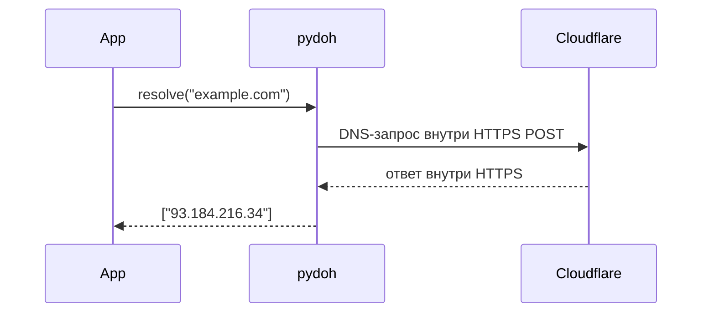

# pydoh

DNS-over-HTTPS резолвер для питона. ноль зависимостей — весь HTTPS через стандартный `http.client`+`ssl`. провайдер/DPI видит только твой HTTPS к cloudflare, а не голые DNS-запросы.



## установка

```
pip install pydoh
```

## юзать

```python
import pydoh

ips = pydoh.resolve("example.com")
```

или подменить резолвинг вообще везде в питоне одной строкой — `requests`, `aiohttp`, что угодно на сокетах будет резолвить через DoH:

```python
import pydoh
pydoh.patch_socket()
```

## фичи

- zero deps, только stdlib
- fallback между cloudflare / google / quad9 если один упал
- кэш по TTL из ответа
- typed (py.typed), питон 3.10–3.13

## что не умеет

не проверяет DNSSEC, не поддерживает TCP-фрагментированные DNS-ответы больше одного UDP-пакета.
