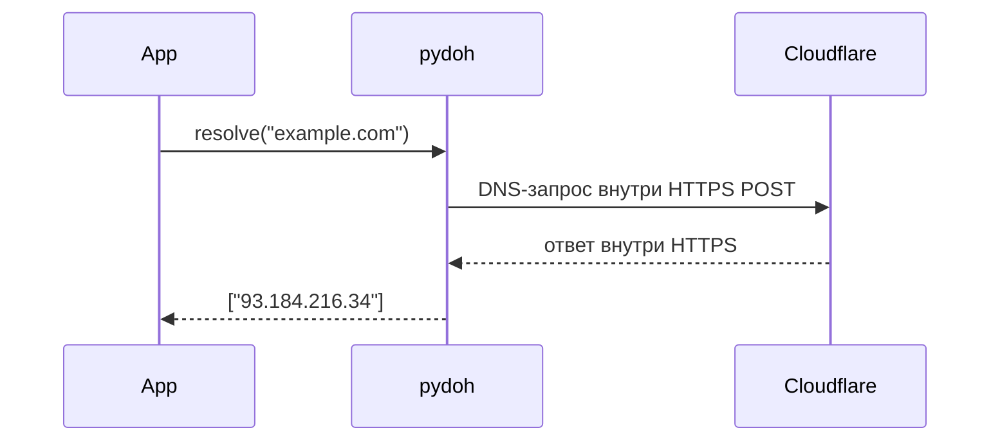

# pydoh

[](https://github.com/ImSavsis/pydoh/actions/workflows/ci.yml)
[](https://codecov.io/gh/ImSavsis/pydoh)
[](https://pypi.org/project/pydoh/)
[](https://pypi.org/project/pydoh/)
[](https://pypi.org/project/pydoh/)
[](https://github.com/ImSavsis/pydoh/blob/master/LICENSE)

DNS-over-HTTPS резолвер для питона. ноль зависимостей — весь HTTPS через стандартный `http.client`+`ssl`. провайдер/DPI видит только твой HTTPS к cloudflare, а не голые DNS-запросы.



## установка

```
pip install pydoh
```

## юзать

```python
import pydoh

ips = pydoh.resolve("example.com")
```

или подменить резолвинг вообще везде в питоне одной строкой — `requests`, `aiohttp`, что угодно на сокетах будет резолвить через DoH:

```python
import pydoh
pydoh.patch_socket()
```

## документация

- [quickstart](docs/quickstart.md) — установка, базовое использование, свой провайдер
- [api](docs/api.md) — все функции с параметрами
- [faq](docs/faq.md) — зачем это надо, что делать если cloudflare забанят, законно ли

## фичи

- zero deps, только stdlib
- fallback между cloudflare / google / quad9 если один упал
- кэш по TTL из ответа
- typed (py.typed), питон 3.10–3.13

## что не умеет

не проверяет DNSSEC, не поддерживает TCP-фрагментированные DNS-ответы больше одного UDP-пакета.
